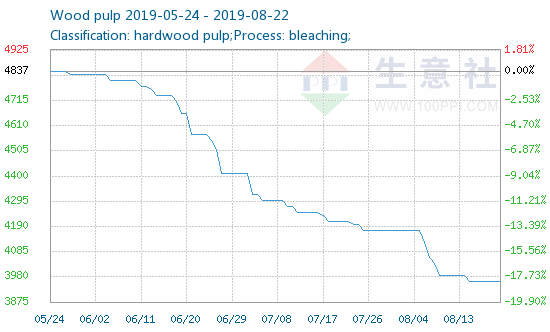

# Machine Learning Use Case for Predictive Maintenance

This project contains a development of a predictive maintenance use case of Machine Learning approaches.

## 🪧 **Project Scenario Description**

*Paper CO is an important player that produces mainly cellulose providing this important material for the paper makers and for their own paper machines. The market is becoming more and more challenging due to international prices downfall of cellulose, see Figure 1.*

Figure 1 - Wood pulp price in China in RMB *(source: [http://www.sunsirs.com/uk/prodetail-958.html])*

*Due the challenging scenario, Paper Co is starting a project to reduce costs in maintenance avoiding over maintain some specific assets and keeping the same availability of all the process. To perform that, it will be necessary to predict failures in the selected assets. 
The head of the operations has asked whether it is possible to predict such events and based on your answers he will change the maintenance plans.*

## 🎯 **The mission**

*We have scheduled a meeting in one-week time with the head of operations in which you will present your findings and provide recommendations about changing the maintenance plans. As far as you know the maintenance plan are done with fixed frequency by calendar time. (A simple presentations of your findings is expected)*

*The first phase is to check the viability of a RUL (remaining useful life) or/and a model to predict the failure with at least 20 cycles ahead. For training your model you will receive a dataset with information of 100 events of failures on these assets. See Table 1 with the information available. In the meeting is also necessary to demonstrate your understanding of the problem and show some statistics of the assets to illustrate the problem and the proposed solution.*

*Using the trained model, you should score for each asset id on the test data providing the information if the asset will failure after more 20 cycles (probability 0-1) or (preferably) how many cycles left the asset still has (RUL). You will submit the test file output which have to contain a single column and one line for each asset (100 total) providing the information above.*

*Your prediction will be scored using quality KPIs for machine learning algorithms, be prepared to comment the KPIs during the interview. You can simulate scenarios to demonstrate how the model perform against a naive process of changing the asset in a fixed period.*

*Finally, you will have to answer how the maintenance team will use your model to reduce costs.*

**Table 1: Dataset with information of failures for each asset id.**

<table>
    <tr>
        <th>Field name</th>
        <th>Description</th>
    </tr>
    <tr>
        <td>Asset id</td>
        <td>Asset code. The code represents a complete run of the asset until its failure. After its failure, it is replaced by another asset with id + 1</td>
    </tr>
    <tr>
        <td>runtime</td>
        <td>A measure of time that resets after failure</td>
    </tr>
    <tr>
        <td>Setting1</td>
        <td>Set point 1</td>
    </tr>
    <tr>
        <td>Setting2</td>
        <td>Set point 2</td>
    </tr>
    <tr>
        <td>Setting3</td>
        <td>Set point 3</td>
    </tr>
    <tr>
        <td>Tag1</td>
        <td>Sensor 1</td>
    </tr>
    <tr>
        <td>Tag2</td>
        <td>Set point 2</td>
    </tr>
    <tr>
        <td>...</td>
        <td>...</td>
    </tr>
    <tr>
        <td>Tag21</td>
        <td>Sensor 21</td>
    </tr>
</table>

## 🎮 Project Execution

Inside the project there are two main folders:

- `analysis` - which contains the analyses performed in the dataset and the main insights obtained from the data
- `modules` - contain the classes used both in exploratory data analysis and in the modeling phase

This project was develop as a Docker image. The project can be run the command `docker-compose -f docker-compose.yaml up -d --build` from the root folder of the project, provided that Docker is installed prior to the command.

## ✅ Technologies Applied

- Python
- Scikit-Learn
- Docker and docker-compose

## 👷‍♂️ Author

Hello there ! My name is Ícaro Augusto Maccari Zelioli, and I am a chemical engineer who is also passionate about data science and data dataengieerings. Check out my profile on [Linkedin](https://www.linkedin.com/in/%C3%ADcaro-augusto-maccari-zelioli/) and my other Data Science works on my [GitHub](https://github.com/IAugustoMZ)